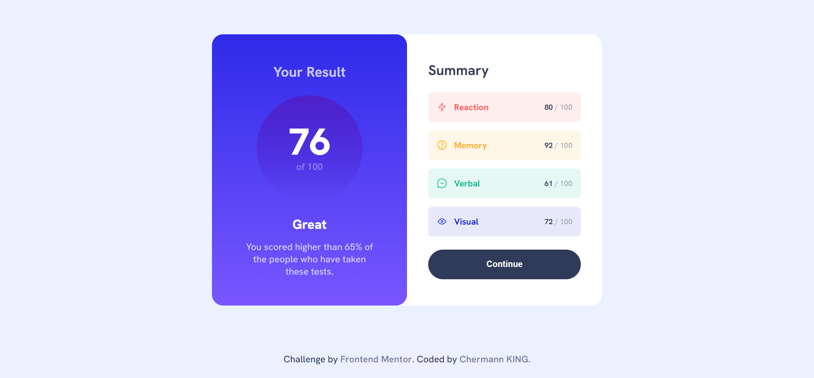

# Frontend Mentor - Results summary component

This is the [Results summary component coding challenge](https://www.frontendmentor.io/challenges/results-summary-component-CE_K6s0maV). Frontend Mentor challenges help improve coding skills by completing realistic projects.

## Welcome! 👋

Thanks for taking a look at my solution to this front-end coding challenge.

## Table of contents

- [Overview](#overview)
  - [Screenshot](#screenshot)
  - [Links](#links)
  - [Built with](#built-with)
- [Author](#author)

### Screenshot

### Links

- Solution URL: https://github.com/Chermann-KING/results_summary_component---NEWBIE
- Live Site URL: https://chermann-king.github.io/results_summary_component---NEWBIE/

### Built with

- Semantic HTML5 markup
- CSS custom properties
- Mobile-first workflow

## Author

- Website - [Hermann MOUSSAVOU](https://hermann-moussavou.com)
- Frontend Mentor - (https://www.frontendmentor.io/profile/Chermann-KING)
- LinkedIn - (https://www.linkedin.com/in/hermann-moussavou)
